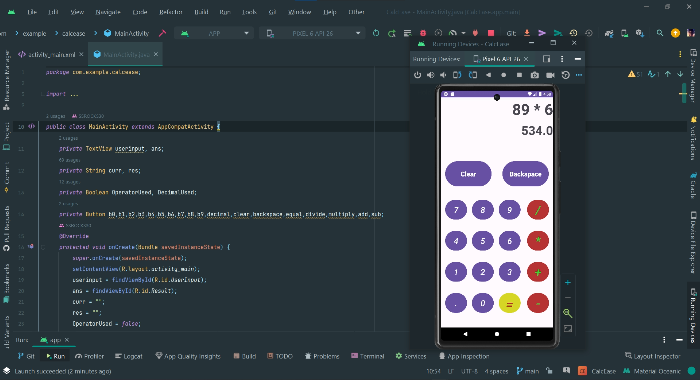
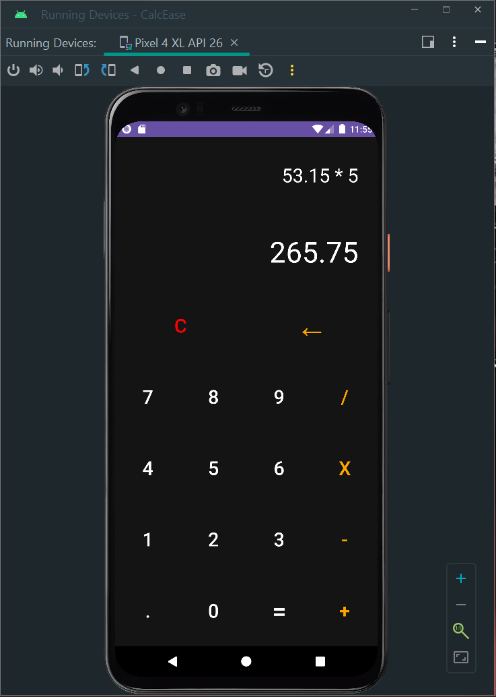

# Simple Calculator App
This is a simple calculator Android application developed using Android Studio and Java. The app allows users to perform basic mathematical operations like addition, subtraction, multiplication, and division.

</img>      </img>

## Features

- Addition (+)
- Subtraction (-)
- Multiplication (*)
- Division (/)

## Getting Started

Follow these instructions to set up the project on your local development environment.

### Prerequisites

- Android Studio (Download and install it from [Android Studio](https://developer.android.com/studio))
- Android device or emulator for testing

### Installation

1. Clone the repository to your local machine using Android Studio or the command line:
   git clone [https://github.com/yourusername/simple-calculator-app.git](https://github.com/SSROCKS30/Calculator.git)
2. Open the project in Android Studio.
3. Build and run the app on your Android device or emulator.

#### Contributing

If you'd like to contribute to this project, please follow these guidelines:

1. Fork the repository on GitHub.
2. Clone your forked repository to your local machine.
